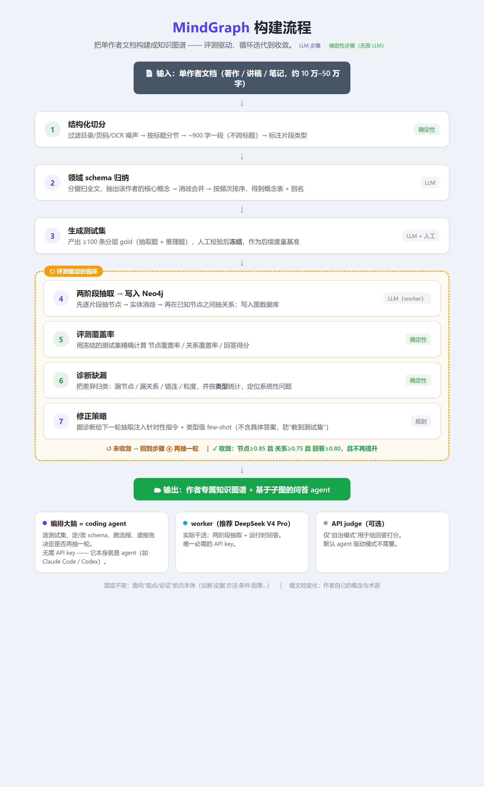

# MindGraph

**English** | [简体中文](README.md)


Build a knowledge graph from a single author's large body of text (essays, lecture
transcripts, notes; roughly 100k–500k characters), so a QA assistant can answer along the
author's own line of reasoning instead of paraphrasing retrieved fragments.

## The problem this solves

Suppose you have a large body of writing by one person — a thinker's collected essays, a
course's transcripts, a practitioner's notes — and you want an assistant that answers
questions "the way that person thinks."

The usual approach is RAG: chunk the text, embed it, retrieve the top-k passages, stuff
them into the prompt. In this setting it has concrete limitations:

- The retrieved pieces are **isolated chunks** — the logical relationship between a chunk
  and the ones around it is lost.
- The model can only **paraphrase** the matched passage; it can't reconstruct the author's
  full reasoning — the evidence behind a claim, its conditions, its counterexamples; or a
  method's steps, when it applies, the principle behind it.
- With no explicit relations between chunks, the model **can't follow the author's reasoning
  chains** across multiple hops.

A knowledge graph helps — it models "claims", "evidence", "methods", "conditions", "causes"
as explicit nodes and relations, so retrieval returns a structured subgraph. But building a
*good-enough* knowledge graph has real friction:

1. you must design an ontology (schema) for the specific author;
2. you must write extraction rules and reconcile different surface forms of one concept;
3. you need a way to **measure** how complete and correct the extraction is, and improve
   from there.

That is normally a one-off manual effort, redone from scratch for each new author. What
MindGraph addresses is turning "build a knowledge graph for a given author" into a
**repeatable, measurable, iterative** process.

## What it does

Given a single-author corpus, MindGraph:

1. chunks the document while preserving argument units (not fixed-length splits);
2. induces the author's domain concept table (domain schema);
3. generates a gold test set to measure extraction quality;
4. extracts nodes and relations in two stages with an LLM, writing to Neo4j;
5. computes coverage, locates gaps by type, adjusts the extraction strategy, and loops to
   convergence;
6. serves subgraph-based retrieval and QA.

What stays fixed is a meta-ontology aimed at "ideas / argumentation" (claims, evidence,
methods, conditions…); what varies per document is the author's own concepts and terms.

### Suitable / not suitable

- **Suitable**: a single author's long-form ideas or teaching material, where you want
  structured, traceable QA.
- **Not suitable**: multi-author / encyclopedic knowledge bases, general-domain KG
  extraction, latency-critical use. It also won't produce the content for you — you need the
  source corpus.

## How it works

<p align="center">
  
</p>

> The diagram labels are in Chinese; the same flow is described in text throughout this section.

**Two-layer schema**:
- meta-layer (fixed): the argumentative structure shared by all "ideas / teaching" text;
  it's what lets an answer take shape.
- domain-layer (induced per document): the author's own concepts, terms, aliases.

**Meta-ontology nodes and relations**:

```
Nodes:     Concept · Claim · Principle · Method · Argument · Evidence · Condition ·
           Counterpoint · Analogy · MentalModel · Question · ReasoningPattern
Relations: SUPPORTS/REFUTES · USES · EXEMPLIFIES · APPLIES_WHEN · ANSWERS ·
           DEPENDS_ON/PART_OF/REFINES/GENERALIZES · CAUSES/ENABLES · CONTRASTS_WITH ·
           REALIZES · COMPOSED_OF
```

Two question types map to two retrieval "spines" over the same node set:

```
Explanatory: Question ←ANSWERS← Claim ←SUPPORTS← Argument →USES→ Evidence
Applied:     Condition ←APPLIES_WHEN← Method →REALIZES→ Principle
```

### Models involved

| Role | What it does | Required |
|---|---|---|
| Orchestrator = coding agent (e.g. Claude Code / Codex) | build the test set, set/revise the schema, run the pipeline, read reports and decide whether to re-extract | No API key (it *is* the agent) |
| worker (DeepSeek V4 Pro recommended) | extraction + answering | Yes (the only required key) |
| API judge (optional) | scores answers, only in "autonomous mode" | Optional |

Hence two modes: **agent-driven** (default; only the worker key, the orchestrator reads JSON
reports to decide) and **autonomous** (add a scoring model and run unattended to convergence).

## Install

```bash
git clone https://github.com/XiHa0/mindgraph.git
cd mindgraph
python -m venv .venv && . .venv/Scripts/activate   # Windows; Linux/Mac: source .venv/bin/activate
pip install -r requirements.txt                    # or: pip install -e . (provides the `mindgraph` command)
```

You need a Neo4j 5.x instance (local or remote). Run the setup script once before first use:

```bash
cypher-shell -u neo4j -p <password> -f mindgraph/schema/constraints.cypher
```

## Configure

```bash
cp .env.example .env       # set KG_WORKER_* (the worker model) and NEO4J_*
```

Only the worker key is required; leave the judge (`KG_JUDGE_*`) empty.

## Usage

Agent-driven mode: the toolbox exposes each step as a command; steps read/write JSON, and the
orchestrator reads the results to decide.

```bash
# 1) chunk
python -m mindgraph.cli chunk    --doc doc.txt --doc-id authorX --out chunks.json

# 2) write schema.json ({"concepts":[...],"aliases":{...}}); build & freeze gold.json

# 3) extract into the graph
python -m mindgraph.cli extract  --chunks chunks.json --schema schema.json --store neo4j --doc-id authorX

# 4) evaluate + diagnose (deterministic, emit JSON)
python -m mindgraph.cli coverage --gold gold.json --store neo4j --doc-id authorX --out coverage.json
python -m mindgraph.cli diagnose --gold gold.json --store neo4j --doc-id authorX --out diag.json

# 5) read coverage.json / diag.json; edit schema / add directives / adjust chunking / re-extract → back to 3
```

Without Neo4j, use `extract --store memory --graph-out graph.json` to validate the pipeline
locally. Build a test set with `python -m mindgraph.testset.run generate|freeze`; autonomous
wiring is in [`mindgraph/SPEC.md`](mindgraph/SPEC.md).

## Status and limitations

- Early version (v0.1); interfaces and defaults may change.
- Entry retrieval currently uses Chinese character-bigram overlap; the setup script already
  creates full-text / vector indexes, which you can switch to.
- Neo4j nodes are written with dual labels `:Type:KGNode` (typed label for constraints/indexes,
  `:KGNode` for generic read queries).
- You must provide the worker model and Neo4j; the judge is optional.
- The design spec [`mindgraph/SPEC.md`](mindgraph/SPEC.md) and code map [`wiki.md`](wiki.md)
  are currently in Chinese.

## Docs

- [`wiki.md`](wiki.md) — full code structure (modules / classes / interfaces / data flow).
- [`mindgraph/SPEC.md`](mindgraph/SPEC.md) — design spec (schema / coverage metrics / test-set
  format / loop orchestration).

## License

[MIT](LICENSE) © XiHa0
